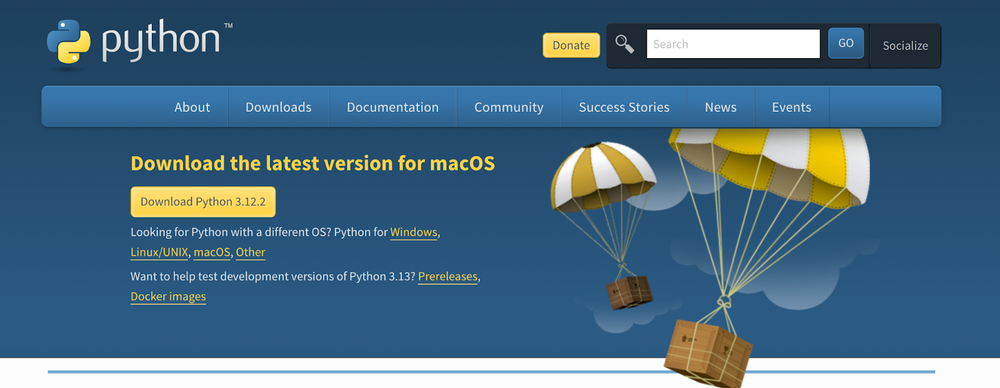
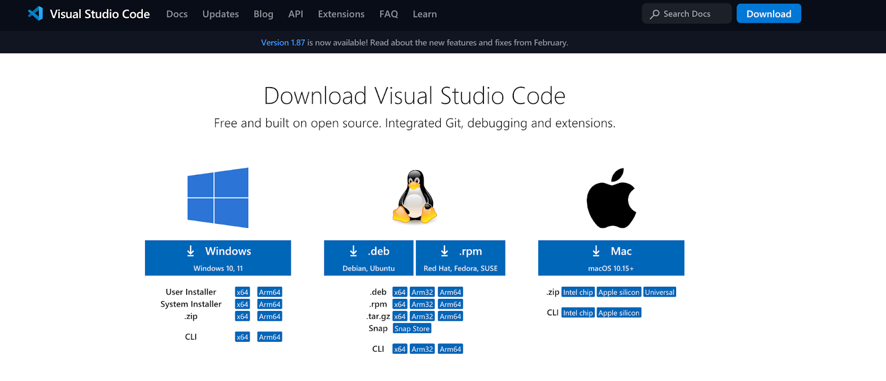

# Lab 6: Visual Studio Code and Streamlit

---

📘 Introduction


In this lab, we transition from mastering OpenAI's API capabilities in Python—ranging from text generation and image creation to transcription and prompt engineering on Colab—to applying these skills towards developing impactful AI projects for social good. As we move forward, the focus shifts to making these projects accessible through user-friendly web applications. To achieve this, we will introduce you to **Streamlit**, a powerful tool that simplifies the process of building and deploying data applications. Additionally, we will guide you through setting up your development environment in **Visual Studio Code (VS Code)**, complete with the Python Extension and Streamlit, ensuring a seamless workflow for your AI projects. 

By the end of this lab, you will be well-equipped to bring your AI-driven solutions to a wider audience, leveraging the power of web applications to make a positive impact in society.

---

## 🎯 Learning Objectives

- **Install Python for Local Development**: Learn how to set up Python on your local machine to create a robust environment for developing AI applications.
- **Learn to Use Visual Studio Code**: Gain proficiency with Visual Studio Code, an industry-standard development tool. You'll learn how to navigate its interface, utilize its extensive feature set for coding efficiency, and customize it for Python development.
- **Set Up OpenAI for Local Development**: Learn the steps to configure OpenAI's API on your local development environment. 
- **Streamlit for Local Coding Environment**: Discover how to use Streamlit to create user-friendly web applications for showcasing your AI projects. This includes installing Streamlit, creating simple web apps, and integrating OpenAI's API features into these apps.

---

## ⏱️ Estimated Time
1 hour

---

## 💵 Estimated Cost
$0.01 (View your OpenAI usage [here](https://platform.openai.com/usage))

---

## 🧰 Materials

- Python
- Visual Studio Code
- Visual Studio Code Python extension
- OpenAI Library
- Streamlit
- Your Lab 2: Generating Text with OpenAI’s Models

## 💡 Understanding the Importance of a Code Editor 
A code editor is a crucial tool for developers, providing an environment to write, debug, and manage code. VS Code is popular due to its versatility, ease of use, and extensive customization options. It supports multiple languages and has a large library of extensions to extend its functionality.

---

## Lab Starts Here

## 🔧 1.1 Installing Python and VS Code

1. Navigate to the official Python [website](https://www.python.org/downloads/) and download the latest version of python that is compatible with your device. 




2. Navigate to the VS Code [platform](https://code.visualstudio.com/download) and install the latest version compatible with your device.



3. [Install](https://marketplace.visualstudio.com/items?itemName=ms-python.python) Python extension for VS Code.

4. Configure Python in VS Code:
    - Open VS Code and open the command palette.
        - For Mac, press Cmd+Shift+P
        - For Windows, press Ctrl+Shift+P
    - Type "Python: Select Interpreter" and press Enter. Choose the Python            interpreter you installed (e.g., "Python 3.13.6").

---

## 🧑‍💻 1.2 Working with VS Code

1. Open VS Code.

2. Create a folder using “Open Folder” found on the top of the screen under “File”.

3. From the File Explorer toolbar, select the New File button on the folder. Name it text_generation.py.
    a. By using the .py file extension, you tell VS Code to interpret this file     as a Python program, so that it evaluates the contents with the Python          extension and the selected interpreter.
    b. To test if your python interpreter is working, paste the following code      in your text_generation.py file.

```Python
print("Hello World!")
```
4. Run the code using the ▷ button on the top right corner. Running the code should display the phrase “Hello World!” in the terminal

5. Finally, to finish setting up your environment for OpenAI development, we need to install the OpenAI library. Input the following command in your **terminal** and type enter, **not** in the Python file.

```Python
pip install --upgrade openai
```

- **Possible issue**: If the above command does not work, try replacing pip with pip3 For further information, refer to the documentation here: [Quickstart tutorial - OpenAI API.](https://platform.openai.com/docs/quickstart?context=python)
  
- If still not working, try **“py -m pip install --upgrade openai”** (not including quotation mark)
  
- **Possible issue**: If you see an **error** “pip The term 'pip' is not recognized as the name of a cmdlet, function, or operable program”, it is possible you have different versions of Python. Try reinstall Python, or the solution post [here](https://www.codewithharry.com/videos/general-python-errors-1/)
  
- **Possible issue**: If you are on a Mac and you get either of the following errors:
    - zsh: command not found: python
    - zsh: command not found: py
    - Make sure Python is actually installed after downloading it to your            computer. 

---

## 🧪 2.1 Test Run with Lab 2: Text Generation 

1. Navigate to your Lab 2a: Text Generations CoLab, where you used OpenAI models to generate text given the prompt. 


2. **Starting from the code cell that imports OpenAI**, copy the code from Lab 2a from **each cell** into your VS Code Python file (.py), NOT in terminal.

 ```Python
from openai import OpenAI
```

3. Run the file with the ▷ button and check for errors.

- **Possible issue**: If you see an **error** “ImportError: No module named openai' it is possible that you have multiple versions of Python installed on your laptop, try the following command in the **terminal** instead. If the above command does not work, try replacing **pip** with **pip3**
  
- **Possible issue**: If you still get the error, try selecting different Python interpreters (you might have multiple). To do this in VS Code, press ctrl + shift + p on your keyboard. A text box should appear at the top of your window. Type in “Python: Select Interpreter” (without the quotation marks), Select “Python: Select Interpreter” and choose Python 3.12.2 (or whichever version you just downloaded). Then, try running your code again. If you have multiple interpreter paths, you can try all of them one by one. 

```Python
pip uninstall openai

pip install --upgrade pip

pip install openai
```

-**Possible issue**: Alternatively, if you still encounter error about “import openai”, see it is possible that you need to [re-install](https://www.python.org/downloads/) Python again.
    - **References**: 
         -[stackoverflow](https://stackoverflow.com/questions/71873182/no-module-named-openai)
         -[Resolving Openai Import error stackoverflow](https://stackoverflow.com/questions/76320002/how-to-resolve-import-openai-could-not-be-resolved-error-pylance-with-pip-in)


--- 

## 🌐 3.1 Streamlit

1. Now that you have your local coding environment set up, we can move on to methods for presenting your project. We will be using **Streamlit**, a free and open source framework that will allow us to create a user interface with just a few lines of code.

2. Open VS Code, and create a new file. Name it streamlitTest.py. Then, copy the following command into the **terminal, not** in the Python file.
- This command will install the streamlit Python package onto your computer so that you can use functions from it in your programs.

```Python
pip install streamlit
```

- **Possible issue**: If the above command doesn’t work, try replacing         **pip** with **pip3**.
- If still not working, try **“py -m pip install streamlit”** (not             including quotation mark)

3. Next, copy the following code into your code editor, and fill in the commented part with your get_completions function from Lab 2: Text Generations. Also, don’t forget to use your own OpenAI API key! **Remember to save your file:**
- For Mac: Command + S
- For Windows: Ctrl + S

```Python
import streamlit as st 
from openai import OpenAI

client = OpenAI(api_key="INSERT YOUR API KEY HERE!") 

# create a wrapper function
def get_completion(prompt, model="gpt-3.5-turbo"):
# INSERT THE BODY OF YOUR get_completions FUNCTION FROM LAB 2!

# create our streamlit app
with st.form(key = "chat"):
    prompt = st.text_input("Insert a description of what your completions function does, and what kind of input you want a user to give it") # TODO!
    
    submitted = st.form_submit_button("Submit")
    
    if submitted:
        st.write(get_completion(prompt))
```

4. To run this Streamlit application, first save the file (Ctrl + S or Command +S), and then enter the following command into the **terminal**, **NOT** using the ▷ button,. Here, we use **“streamlitTest.py”** because that’s what we named the file in Step 2.

```Python
streamlit run streamlitTest.py
```


After running this command, you should be able to see a very basic web application, shown below, consisting of an input box, by following the **local URL** Streamlit has printed in your terminal. Streamlit also offers many other frontend components, such as charts, a drawable canvas, and more! For your final project, feel free to look up whatever you may need in their documentation [here](https://docs.streamlit.io/library/api-reference).


Finally, test the application in the browser by providing an input and check the output.


- **Possible issue**: If you see an **error** “streamlit : The term 'streamlit' is not recognized as the name of a cmdlet, function, script file, or operable program.” , try the following command in the terminal instead:

```Python
python -m streamlit run streamlitTest.py
```

**OR**

```Python
python3 -m streamlit run streamlitTest.py
```

**OR**

```Python
py -m streamlit run streamlitTest.py
```

- **Possible issue**: If you receive the following error: 
		- zsh: command not found: streamlit 
		
- Try uninstalling streamlit and reinstalling it in the terminal. You can do that with any of the following commands that work in your terminal:

```Python
# try any of these variations in your terminal to see which one works
# option 1
pip uninstall streamlit 

# option 2 (works for MacOS) 
pip3 uninstall streamlit 

# option 3 (works for Windows)
py -m pip uninstall streamlit 
```

- **Possible issue**: If you see a blank page on your browser, check 1) if you have saved your .py file before running and 2)  if your code is correct and complete.

- **Possible issue:** If the browser does not show the desired output, check if your code is correct and complete.

- **Possible issue:** You might run into an error that says: “Streamlit requires raw Python (.py) files, but the provided file has no extension.” If that is the case, delete the current .py file that you are working on and create a new one through VSCode then name it streamlitTest.py. 

- **Possible issue:** In case you see an **error** “**Invalid value: File does not exist: …”**, that’s because your Python file does not exist in the folder that is shown on your terminal. You may want to use the cd command to access the folder where the Python file is located. In the screenshot below, I need to access the folder called “BUS118iS2024”, where the Python file is located. For more information about navigating the folders in the terminal, please see [here](https://www.ibm.com/docs/en/aix/7.1?topic=directories-changing-another-directory-cd-command).

- If you keep getting multiple errors, try closing all your files and your VS Code window, re-open the files, and run the code again. You can also kill the terminal (click the trash can icon in the terminal) and run the code again.

5. Finally, to stop the Streamlit server, press Ctrl+C in the terminal.

---

## 🎉 Congratulations, you have successfully finished the lab!
Please submit your work as 
1) a .py file and
2) 2) screenshots of your output of Sec 2.1 in the terminal and
3) output of Sec 3.1 from both the browser and in the terminal. To help protect your API security. 

Please follow these steps before submitting:
1) Please change your API key in your code to “my-api-key-here”

---

## 🔗 References
- [Download Python](https://www.python.org/downloads/)
- [Download Visual Studio Code - Mac, Linux, Windows](https://code.visualstudio.com/download)
- [Get Started Tutorial for Python in Visual Studio Code](https://code.visualstudio.com/docs/python/python-tutorial#_create-a-python-source-code-file) 
- [Python - Visual Studio Marketplace](https://marketplace.visualstudio.com/items?itemName=ms-python.python) 
- [Quickstart tutorial - OpenAI API](https://platform.openai.com/docs/quickstart?context=python)
- [Install Streamlit using command line](https://docs.streamlit.io/get-started/installation/command-line)
- [API Reference - Streamlit Docs](https://docs.streamlit.io/library/api-reference) 
- [Cheat sheet - Streamlit Docs](https://docs.streamlit.io/library/cheatsheet)


